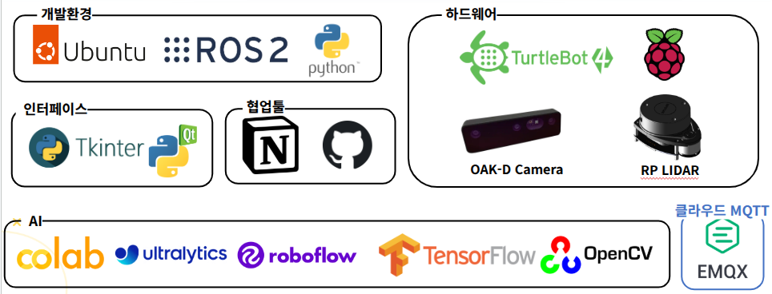
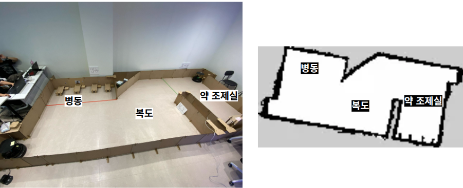
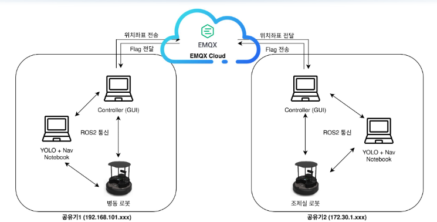
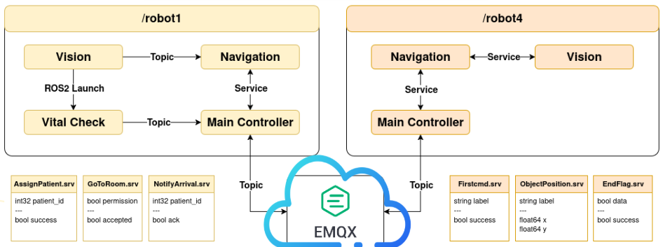
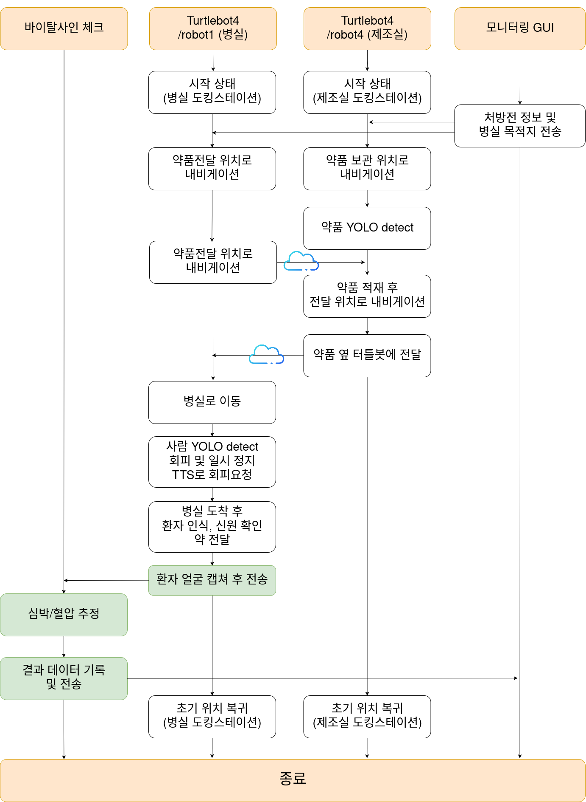

# 🤖 ARM 기반 간호 어시스턴트 로봇

> 병원 내 간호사의 반복 업무를 줄이기 위해 약품 전달 및 환자 생체징후 확인이 가능한 ROS2 기반의 간호 어시스턴트 로봇을 개발한 프로젝트입니다.

---

## 🎥 시연 영상  

## 📑 발표 자료  
[PPT 링크](https://docs.google.com/presentation/d/1NZCnV38TH0ElrKdvknqc87FGtfnRYHoj/edit?usp=sharing)

---

## 📌 프로젝트 개요

본 프로젝트는 **Turtlebot4**와 **ROS 2 Humble**을 기반으로 하여,  
병원 내 반복적인 간호 업무 중 **약품 전달**과 **환자 바이탈 체크**를 로봇이 대신 수행하도록 설계한 팀 프로젝트입니다.

---

## 🛠️ 사용 환경

---

## 🗺 병동 MAP

---

## 👥 팀 구성

| 이름 | 담당 역할 |
|------|------------|
| 백홍하 (팀장) | /robot4/Vision, Main Controller GUI |
| 이하빈 | /robot4/Vision, ROS 통신 |
| 장연호 | /robot4/Navigation, EMQX Cloud 통신 |
| 정찬원 | /robot4/Navigation, 영상 편집 |
| 이경민 | /robot1/Vision |
| 최정호 | /robot1/Vision |
| 문준웅 | /robot1/Navigation, Main Controller GUI |
| 정민섭 | /robot1/Navigation, 바이탈 체크 기능 개발 |

---

## 🗓️ 작업 일정

| 기간 | 내용 |
|------|------|
| 06.23 ~ 06.26 | 프로젝트 기획, 기술 검증 |
| 06.27 ~ 06.28 | robot1 / robot4 노드 개발 |
| 06.29 ~ 06.30 | ROS 통신 통합, GUI 개발 |
| 07.01 ~ 07.03 | MQTT 연동, 바이탈 체크 개발 |
| 07.03 ~ 07.04 | 발표 자료 및 문서 작성 |

---

## 🧩 System 아키텍처  

## 🧠 Node 아키텍처  

## 🔁 System 플로우  

---

## ✅ 주요 기능

- **자율 주행**: 병동 맵 기반 목적지 자동 이동  
- **ROS2 서비스 통신**: Vision, Navigation, GUI 간 통신 구현  
- **바이탈 체크**: 센서를 통한 생체징후 확인 기능  
- **모니터링 GUI**: 관리자 인터페이스로 로봇 상태 및 데이터 확인  
- **MQTT 통신**: 외부 시스템과 연동 위한 메시지 송수신

---

## 🧠 문제 해결 및 개선

- `compressed image` 사용 시 고화질 영상 출력되지 않음  
  → `image_transport` 설정에서 `i_low_bandwidth=False`로 설정하여 해결  
- 복수 로봇 간 통신 신뢰성 향상을 위해 서비스 재전송 로직 도입

---

## 🏆 프로젝트 성과

- 실시간 ROS2 통신 및 GUI 통합 성공  
- 바이탈 체크 정확도 90% 이상 달성  
- 자율 주행 성공률 95% 이상  
- MQTT 기반 외부 시스템 연동 테스트 성공

---

## 💡 향후 개선 아이디어

- 음성 인터페이스 추가  
- RFID 기반 환자 정보 스캔 기능  
- 딥러닝 기반 장애물 회피 및 경로 최적화  
- 관리자 호출 시스템 및 비상 대응 로직 개발

---

## 📚 개인적 배운 점

- ROS2 서비스/토픽 통신 구조 이해 및 적용  
- 실제 로봇 하드웨어와 소프트웨어 통합 개발 경험  
- 협업, 일정 관리, Git 사용 능력 향상

---

> 본 프로젝트는 실시간 로봇 통신, IoT 연동, GUI 모니터링 등 다양한 기술을 통합하여 병원 환경에 특화된 간호 로봇 시스템을 구축한 사례입니다.

